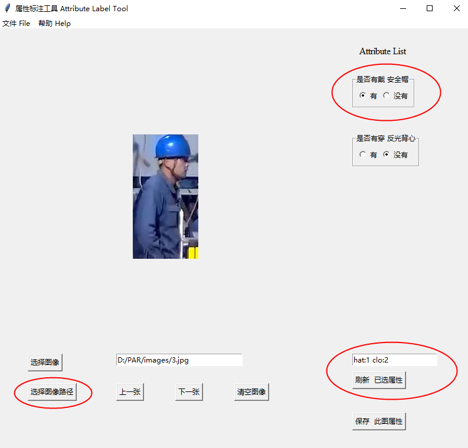
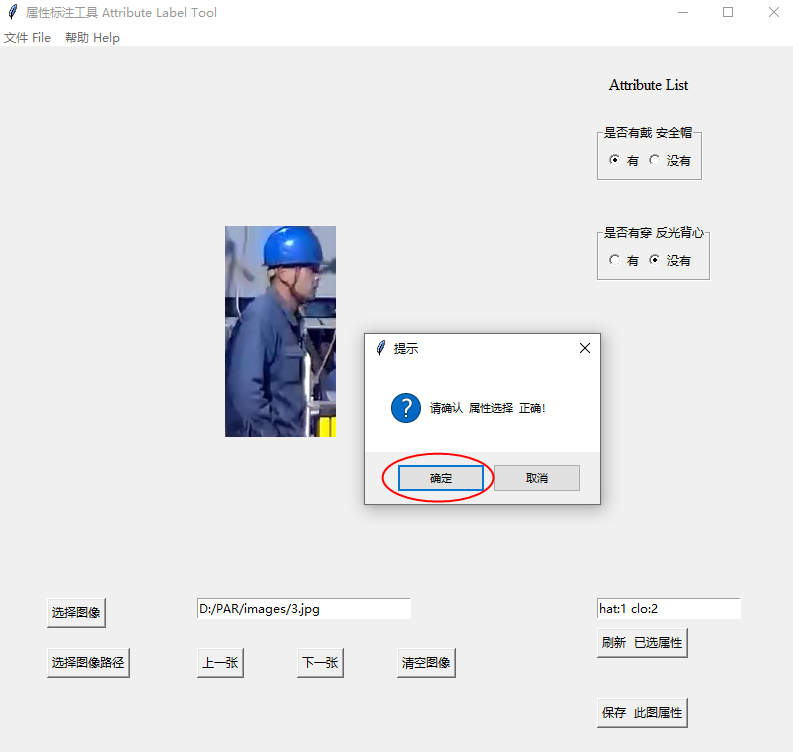
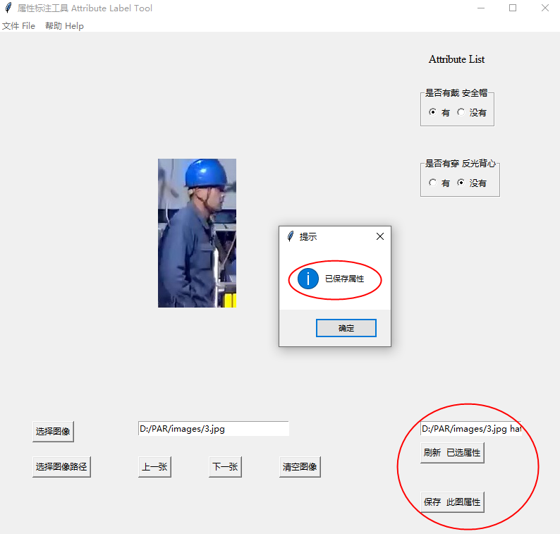

# Attribute Tool


## Install
```bash
conda env create -f environment.yml
```

## Run
```bash
python Attribute_GUI.py
```

## Release as exe
```bash
pyinstaller -F Attribute_GUI.py -w
```

## Demo

<p align='center'>

</p>


<p align='center'>

</p>

<p align='center'>

</p>
